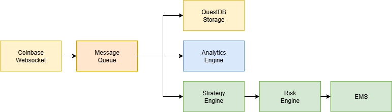

# Designing a Modular Crypto Trading System (Part 1)

## Introduction
Trading systems are usually shrouded in mystery, with screenshots of fancy dashboards and vague "we do AI-powered trading" promises. I wanted to go the opposite way: build a simpel market-making stack from scratch, share the journey openly, and make it as technically solid as possible.

This series will document how I'm designing and coding a modular trading system for crypto markets, starting with Bitcoin. The objectives are to:

* **Learn**: Improve my technical skills and play around with a series of tools that I otherwise wouldn't have used.
* **Understand**: Get deeper market insights into from the ground up of crypto trading by working with raw data.
* **Share**: Make this an open project so others can follow along, learn from it, or even contribute.

I am not, myself, a crypto trader, but I do have quite a bit of experience in traditional financial trading. In that context I normally work with already built systems, and while I understand them I want to be able to build my own. In the last few years there have been a couple of interesting open source tools released that I wanted to try out, but I can't really at work.

## Principles I'm Following
From experience and reasearch, I've boiled down what I want for the architecture to five core principles:

1. Modular: Each component should be swapabble without breaking everything else.
2. Event-driven: The system should react to every market tick in real time. No polling.
3. Resilent: If a service crashes, I should be able to restart without losing data.
4. Scalable: The system should be able to scale up to handle a lot of requests.
5. Transparent: Easy to debug and reason about (because 'black box' systems are bad).

When working with legacy systems you often don't really have the luxury to follow these principles, but I'm hoping that when working tabula rasa I can save future me quite a few hours of cursing.

## High-Level Architecture

Each block is a separate module:

* Market Data Ingestion (using websocket)
* Queue
* Storage
* Analytics Engine
* Strategy Engine
* Risk Engine
* EMS

## Tech Stack Choices
I want to take the opportunity to familiarize myself with a few libraries and tools I've worked less with so I'll be using the following:

- **Redis** for the queue
- **QuestDB** to store the tick data
- **DuckDB & Polars** for fast analytics on local data

This is not intended to be a fully productive system, so I'm not really going to over engineer absolutely everything. I'm just trying to get a feel for what's possible and how it works.

## Roadmap
- [X] Phase 1: Architecture & Setup (this post)
- [] Phase 2: Real-time ingestion from Coinbase
- [] Phase 3: Order book replay & analytics
- [] Phase 4: Backtesting market-making strategies
- [] Phase 5: Live execution with risk controls

## Wrapping Up
What's the point of writing this up? Well, first of all I hope getting this out there helps keeping me accountable and motivated. I also hope that putting this out for C&C helps others to learn from my mistakes and successes. I'm not, by far, the most experienced crypto trader around, but I'm hoping that by sharing my journey I can help others to learn from it.